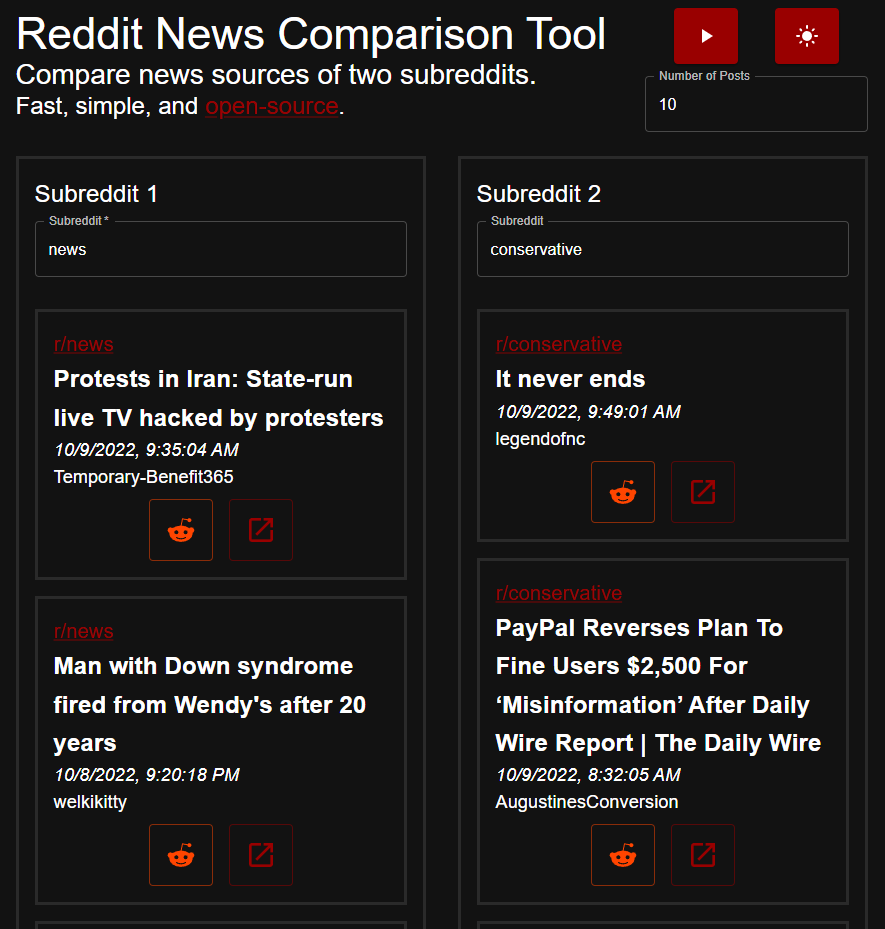

# Reddit News Comparison Tool
A fast, lightweight React web application for quickly comparing the news articles of two subreddits. Uses the fetch API for making requests to Reddit and Material UI for frontend design.

## Examples

## License
MIT License.
